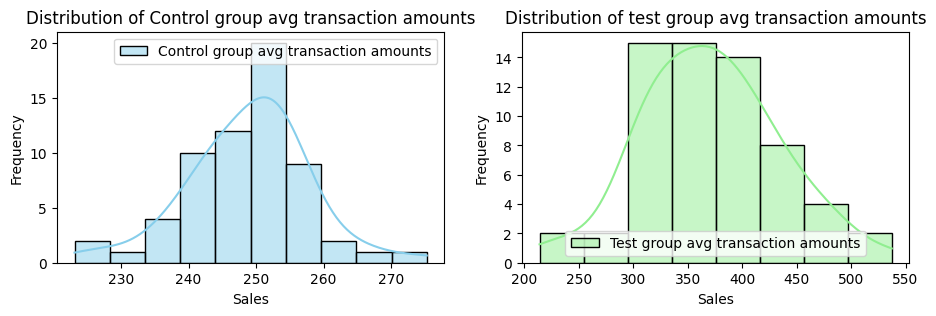

# Credit-Card-Launch-Analysis-Data-Analytics-
# 💳 VK Credit Card Launch Analytics

📌 **Domain**: FinTech | Customer Analytics | A/B Testing  
🛠 **Tools**: Python, Pandas, Seaborn, Matplotlib, Scipy (Z-Test), MySQL, Jupyter Notebook

---

## 🎯 Objective
To identify untapped customer segments using credit, demographic, and transaction data — and validate the impact of launching a new credit card using A/B testing and hypothesis testing.

---

## 📊 Phase 1: Customer Profiling & Exploratory Data Analysis

🔗 **Combined 3 data sources**:  
▪ `customers.csv` (1,000)  
▪ `credit_profiles.csv` (1,004)  
▪ `transactions.csv` (500,000)

🧹 **Data Cleaning & Enrichment**:  
▪ Replaced missing incomes with occupation-wise median  
▪ Fixed age outliers (>80, <15) using group medians  
▪ Filled null credit limits based on credit score band logic  
▪ Capped outstanding_debt at credit_limit using business logic

🔎 **Key Insights from Analysis**:  
▪ Age group 18–25 = 26% of user base  
▪ Lower income, credit usage, and limits  
▪ Top 3 categories: Electronics, Fashion, Personal Care  
▪ Preferred platforms: Amazon, Flipkart, Alibaba

📷 **Sample Visualization**:  


---

## 🚀 Phase 2: Campaign Design, Launch & Evaluation (A/B Testing)

🎯 **Campaign Goal**:  
Measure the effectiveness of a newly launched credit card for customers aged 18–25

📦 **Experimental Design**:  
▪ Effect size = 0.4 → Sample size = 100  
▪ Test Group = 100 users (age 18–25), 2-month trial  
▪ Control Group = 40 users, same demographics, no new card  
▪ KPI: Average transaction value increase

📐 **Hypothesis Test Results (Z-Test)**:  
▪ Z-score = 2.74 > 1.64 → Reject Null  
▪ p-value = 0.003 < 0.05 → Statistically significant uplift  
▪ Campaign conversion = 40%

📷 **Post-Campaign Snapshot**:  


---

## ✅ Project Outcomes

- Identified a high-potential customer segment for credit expansion  
- Designed a cost-effective, statistically sound A/B test  
- Verified campaign success with real lift in transaction values  
- Provided actionable customer intelligence for marketing & credit teams

---

## 📂 Project Structure

```
VK_CreditCard_Launch/
├── customers.csv
├── credit_profiles.csv
├── transactions.zip
├── avg_transactions_after_campaign.csv
├── phase_1_VK_bank.ipynb
├── phase_2_VK_bank.ipynb
├── analysis.png
├── download.png
├── README.md
```
